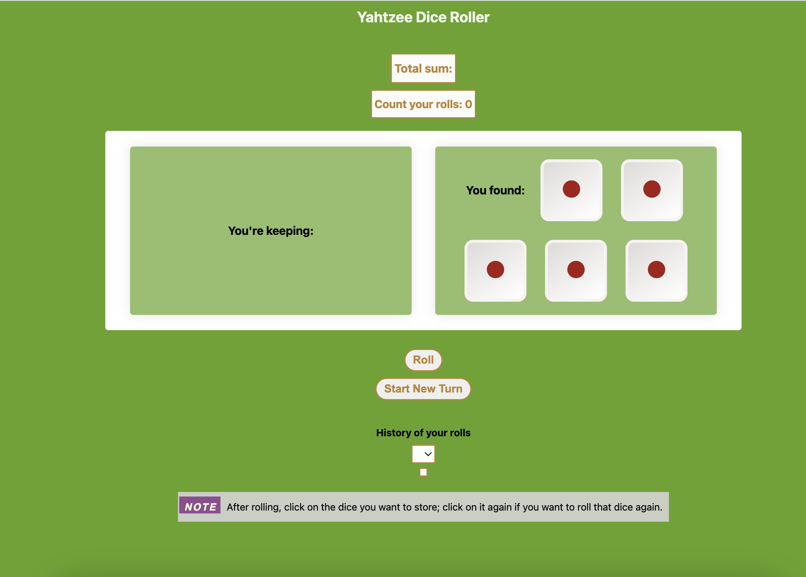
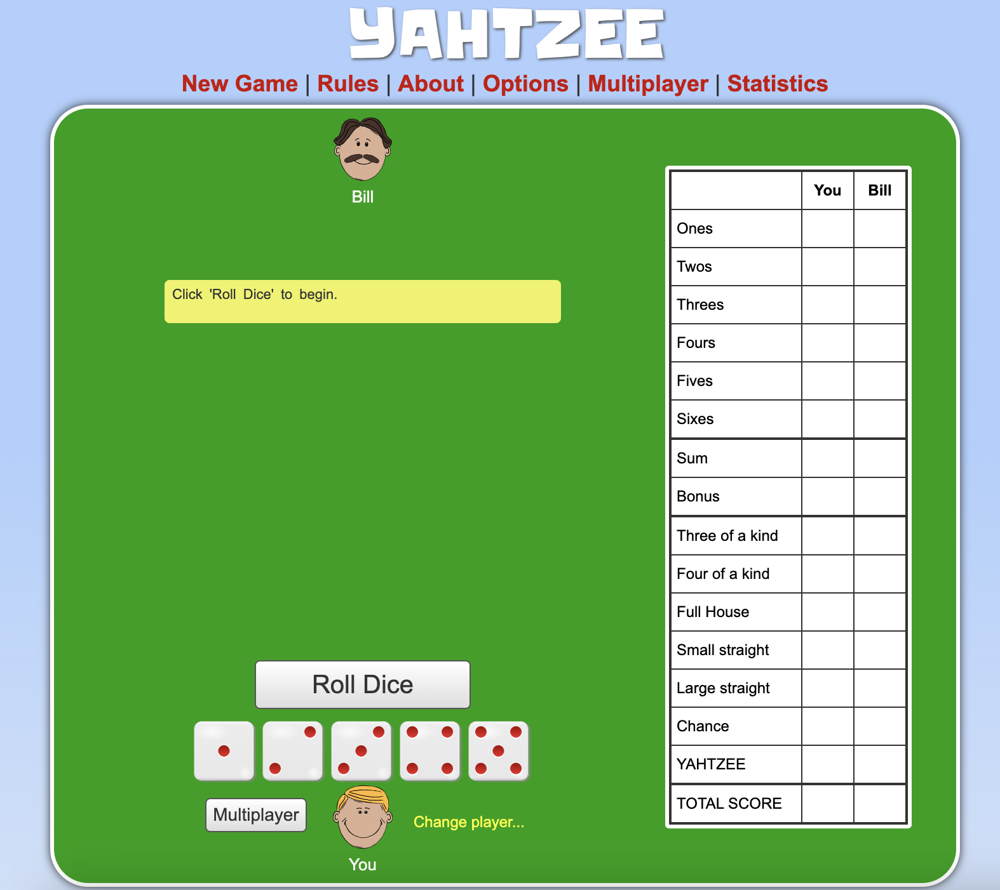
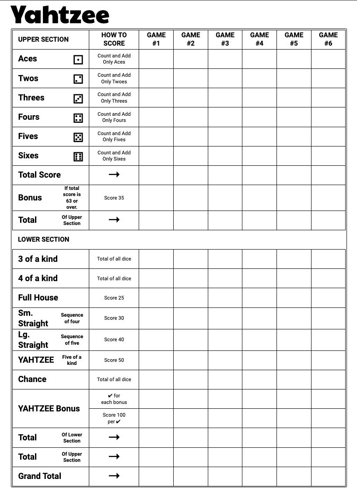

# Yahtzee – Feature extension bootcamp project

## What

Fullstack bootcamp project. Feature extension of another student's MVP project.

Original work by: Maria Rinaldi (GH: [@MaryRinaldi](https://github.com/MaryRinaldi)) – [link to repo](https://github.com/MaryRinaldi/Yahtzee_Dicee).

Yahtzee game.

## Scenario

I have been asked by my PM to build upon code already written by a collegue.

Criteria/Constraints:

- Maintain aesthetic as much as possible while adding required features and with (below) design inspiration in mind
- Style with vanilla CSS (no external libraries or frameworks)

### Required features

- Full Yahtzee game logic
- Scoreboard
- Saving user scores to backend

If time allows:

- Authentication
- Permit two players to play against each other in same session

## Design

### Original page layout



### Target page layout

Layout example with scoreboard from [link](https://cardgames.io/yahtzee/).



### Example of Scorboard



## Running

### Start expresss server

1. In the terminal run:

```
npm start
```

Don't kill it; let it run.

### Start frontend dev server

2. In a fresh, second terminal run:

```
cd client
npm run dev
```

Don't kill it; let it run.

### Run mysql

3. In a third terminal run:

```
mysql -u root -p
<enter your mysql password>
USE dice;
```

Or if you already have set up mysql so you skip entering password:

```
mysql
USE dice;
```

Fin!

## Setting up project

### Open project in VSCode

1. Once the project is on your machine, drag the folder and drop it in VSCode to open it or run the [shortcut](https://www.freecodecamp.org/news/how-to-open-visual-studio-code-from-your-terminal/):

```
cd <path to project directory>
code .
```

### Add DOT env with your DB password

2. Create a .env file at the top level of your project with the following (all other details are already in the model/database.js file)

```
DB_PASS=<your password>
DB_USER=<your username>
```

### Create DB

3. Open up the terminal in VSCode and run

```
mysql -u root -p
<enter your mysql password>
CREATE DATABASE dice;
```

Or if you already have set up mysql so you skip entering password:

```
mysql
CREATE DATABASE dice;
```

You can kill terminal.

## Installation steps

### Install backend packages and set up db tables and populate with initial data

1. In the terminal run:

```
npm i
npm run migrate
```

### Install frontend packages

2. In the same terminal run:

```
cd client
npm i
```

_This is a student project that was created at [CodeOp](http://codeop.tech), a full stack development bootcamp in Barcelona._
